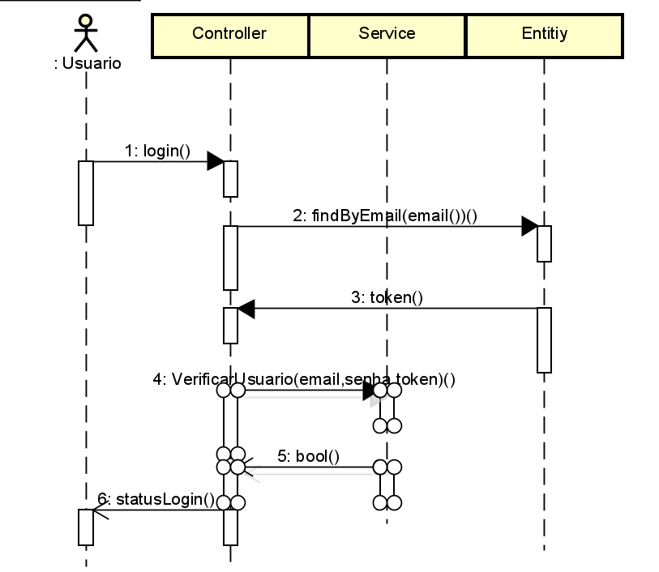
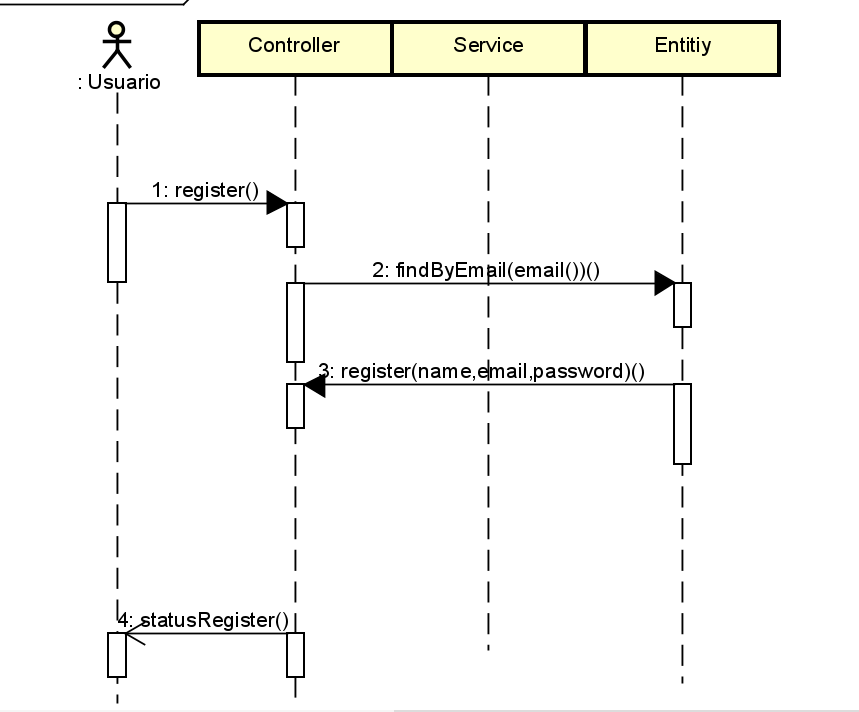

<!DOCTYPE html>
<html lang="pt-BR">
<head>
    <meta charset="UTF-8">
    <meta name="viewport" content="width=device-width, initial-scale=1.0">
    <title>Documentação do Projeto Heartcare</title>
</head>
<body>

<h1>Heartcare Documentação</h1>

Este repositório contém a documentação e os diagramas relacionados ao projeto <strong>Heartcare</strong>. Abaixo está uma lista dos arquivos disponíveis e uma breve descrição de cada um deles.

<h2>Estrutura do Repositório</h2>

<h3>Arquitetura do Software</h3>

Imagens que descrevem a arquitetura geral do sistema Heartcare, ilustrando como os diferentes componentes do sistema interagem entre si.

    
    
    
    
    
    

<h3>Diagramas</h3>

Diagramas de fluxo para os processos principais do sistema.

    
    
    

<h3>Mapas Conceituais</h3>

Mapas conceituais que explicam os conceitos principais e a estrutura do projeto Heartcare.

    
    
    
    

<h3>Modelos e Protótipos</h3>

Protótipos do projeto Heartcare. Clique nas imagens para visualizá-las em tamanho completo.

    
    
    
    
    
    
    
    
    

<h3>Outros Arquivos</h3>
<ul>
    <li><strong>Modelo_físico_heartcare.sql</strong>: Script SQL para o modelo físico da base de dados do sistema Heartcare.</li>
</ul>

</body>
</html>
